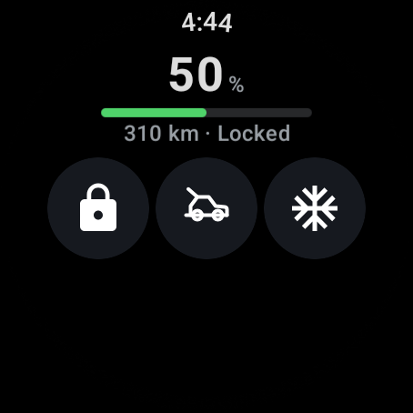
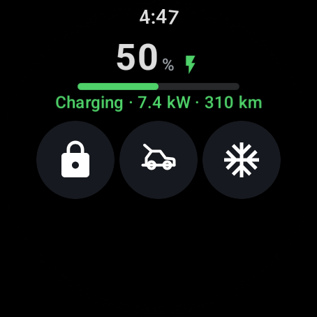
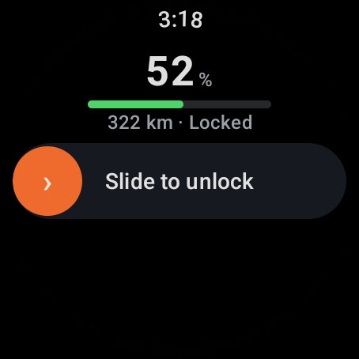

# ZkrWatch

A native **Wear OS** app for the **Zk 7X** electric SUV — check your battery and range, and
lock, unlock, open the trunk, or start climate, right from your wrist. It talks directly to the
vehicle's cloud service, so no Home Assistant, companion phone app, or VPN is required.

<p align="center">
  
  
  
</p>

> Unofficial, community-built, and **not affiliated with the vehicle's manufacturer**. Built on
> the excellent work of **[Fryyyy](https://github.com/Fryyyyy)** (see [Credits](#credits)).

## Features

**Vehicle status**

- 🔋 **Battery % + range**, live from the vehicle's cloud
- ⚡ **Charging indicator** with the live charge rate (kW) and **time-to-full ETA**
- 🌡️ **Cabin temperature** shown on the Climate button
- 🟠 **Low-battery warning** — the charge bar turns amber/red as it runs low
- 🕒 **"Updated ago"** freshness cue so you know how current the reading is
- 🔒 Current **lock state** at a glance

**Remote controls**

- 🔒 **Lock** / 🔓 **Unlock** (slide-to-confirm)
- 🚗 **Open trunk** (slide-to-confirm)
- ❄️ **Climate** precondition toggle
- 🛡️ **Sentry Mode** — arm/disarm the car's surveillance mode
- 💡 **Flash lights** to find the car in a car park *(opt-in)*
- 🔌 **Start / stop charging** *(opt-in)*
- 📳 **Haptic feedback** and an **in-place progress ring** while a command runs
- ⚠️ Clear, cause-specific errors (*Car unreachable*, *Sign-in expired*, *Car declined*)

**Personalization & glanceability**

- 🎛️ **Customizable buttons** — show/hide any action from the **Buttons** screen so small
  watches stay uncluttered
- 🧩 **Tile** (glanceable battery, **with Lock/Unlock**) and **watch-face complication** (SOC)
- 🔄 **Long-press the battery** to force a refresh
- 👆 **Rotating bezel / crown** scrolling and **swipe-to-dismiss** settings

**Under the hood**

- 🔐 Credentials stored in the watch's **hardware-backed Keystore**
- 📶 Works over watch Wi-Fi/LTE **or** the phone's Bluetooth data proxy — no VPN

## Limitations & important notes

- **This is not a car key.** The app can *remotely* unlock, lock, open the trunk, and start
  climate — but you still need your **physical key fob or phone digital key to drive** the car.
  Remote unlock does not authorise driving.
- **Dedicated account required.** The cloud API allows one active session per account, so
  logging in from the watch logs out other sessions. Use a **separate account with the car
  shared to it** (the same approach as the Home Assistant integration).
- **You must supply your own API keys.** Extract them once with
  [zeekr_key_extractor](https://github.com/Wysie/zeekr_key_extractor) — the same keys the Home
  Assistant integration uses. They are never bundled in the app.
- **Sideload only.** The app relies on reverse-engineered keys, so it isn't on the Play Store.
- **Unofficial API.** The manufacturer may change the backend at any time and break this app.
- **Region:** built and tested for **Australia (SEA region)**. Other regions may need endpoint
  or `COUNTRY_CODE` changes.
- Commands are sent asynchronously; the on-screen state updates after a short refresh.

## Install (for users, no coding)

1. Download `app-release.apk` from the [Releases](../../releases) page.
2. Follow **[setup/README.md](setup/README.md)** — a cross-platform script installs the app and
   imports *your* keys. The only tool needed is `adb`, which the script downloads for you.

The published APK contains **no keys** — everyone uses the same app and configures it with their
own credentials, stored encrypted on the watch.

## Build from source (for developers)

Requires Android Studio (bundles the JDK, Gradle, and SDK).

```bash
# Debug build (personal): put your keys in keys.properties (git-ignored), then:
./gradlew :app:assembleDebug

# Release build to share (keyless): build WITHOUT keys.properties so the APK has no secrets.
./gradlew :app:assembleRelease
```

Run the crypto parity tests (see [How it works](#how-it-works)):

```bash
./gradlew :app:testDebugUnitTest
```

## How it works

The app reproduces the vehicle cloud's auth + request-signing stack in Kotlin/Java: a multi-step
login (RSA-encrypted password → bearer token), two request-signing schemes (HMAC and an
app-signature), and AES-encrypted VIN headers. The crypto is verified **byte-for-byte** against
golden vectors captured from the reference Python library — see `app/src/test/` and
`tools/gen_vectors.py`.

## Security

- API keys and tokens are encrypted at rest with a **Keystore-backed** key (Tink AEAD); they
  are never stored in plaintext on the watch and never compiled into the shared APK.
- Status polling runs only while the app is on-screen — no continuous background polling.

## Credits

This app stands entirely on the shoulders of **[Fryyyy](https://github.com/Fryyyyy)**, who
reverse-engineered the vehicle's API and built the
**[Home Assistant integration](https://github.com/Fryyyyy/zeekr_homeassistant)** and the
**[zeekr_ev_api](https://github.com/Fryyyyy/zeekr_ev_api)** library. The auth flow, request
signing, and endpoints here are a port of that work — it would not exist without it. 🙏

Key extraction: **[zeekr_key_extractor](https://github.com/Wysie/zeekr_key_extractor)**.

## Disclaimer

Provided "as is", without warranty. This is an independent hobby project, **not affiliated with,
endorsed by, or supported by the vehicle's manufacturer or its affiliates**. Use at your own
risk. You are responsible for your own account, keys, and vehicle.

## License

[MIT](LICENSE) — includes attribution to Fryyyy's MIT-licensed work.
